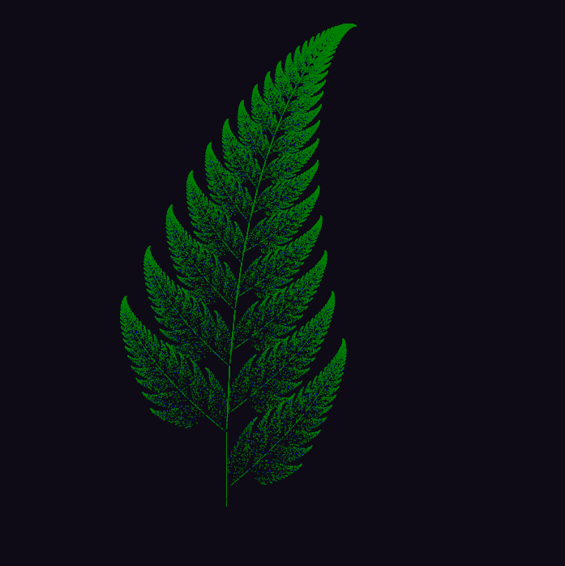
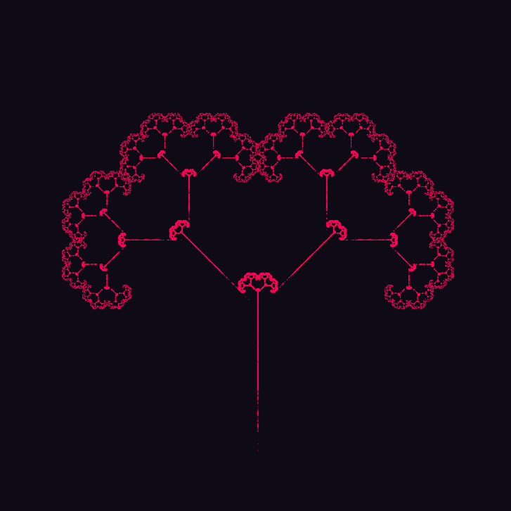
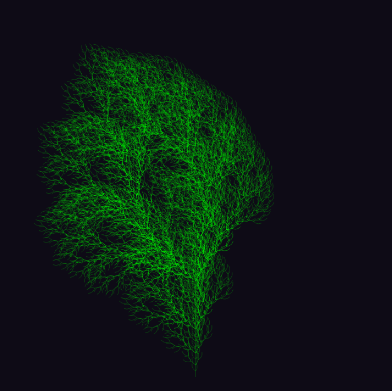
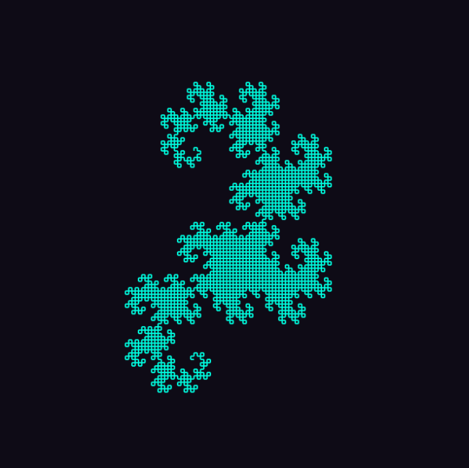
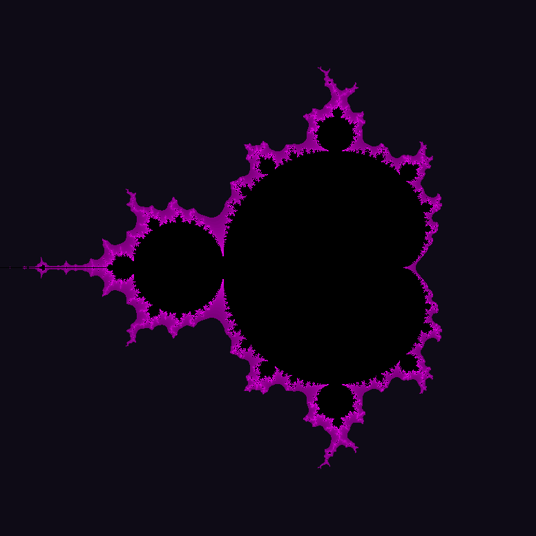
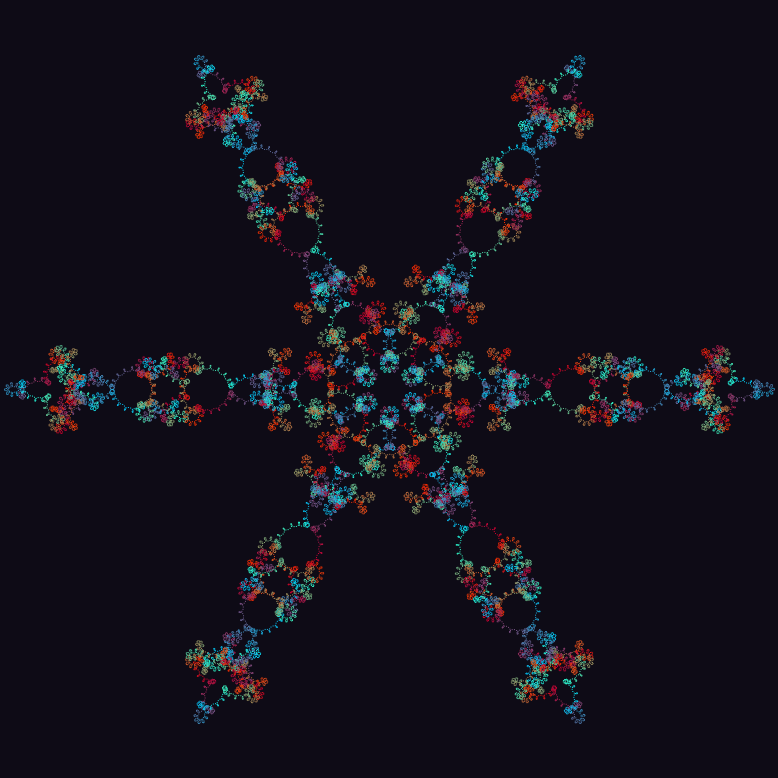
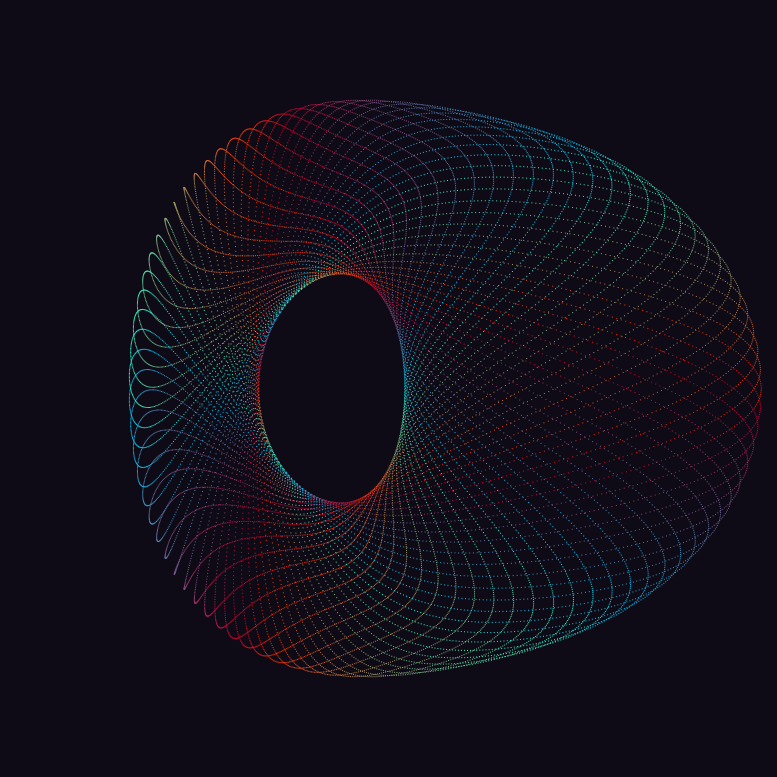
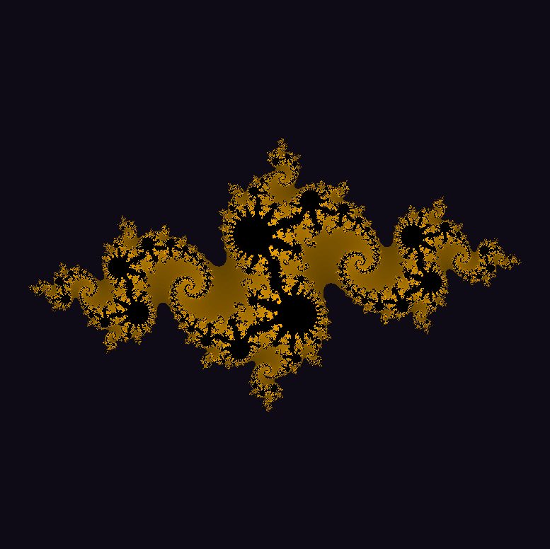

# Fractal Visualizations
Interactive visualizations of 4 fractal algorithms and 1 fractal-like spirograph. 
Visit: https://quinnbooth.github.io/Fractal-Visualizations/
  
This project has been optimized for Google Chrome and Microsoft Edge.
  

  
   
  <em>Figure 1: Julia Set</em>

 

## Author

👨‍💻 **Quinn Booth** - `qab2004@columbia.edu`
  

## How to Use

First, visit the website above. Once there, click on a fractal that catches your interest and start experimenting with the available controls.  This project has been optimized for Google Chrome and Microsoft Edge. Theoretically, it should work on other browsers too. Enjoy your exploration of the fascinating world of fractals!  
 
# How it Works

The hub page provides access to five different fractal visualizations. Each visualization is dynamically updated using an algorithm to create an interactive experience.  

## Barnsley Fern
 
The Barnsley Fern and its variants are fascinating fractals that are generated through the use of probabilistic matrix operations. The process begins by plotting a single point, and then its coordinates are transformed using a specific matrix operation. These matrix operations involve multiplication by a matrix [[A, B], [C, D]] and subsequent addition with [[E], [F]]. This transformation is repeated multiple times, resulting in a sequence of points that eventually form a visually intricate fern-like image. 

 
<table>
  <tr>
    <td>
      
      
<em>Figure 2: Barnsley Fern</em>

    </td>
    <td>
      
      
<em>Figure 3: Fractal Tree</em>

    </td>
  </tr>
</table>

The probabilistic nature of the process adds an element of randomness to the transformations. At each iteration, the specific matrix operation to be applied is chosen based on a set of probabilities associated with each transformation. This probabilistic aspect contributes to the self-similarity and complexity observed in the final fractal image. 

By iteratively applying these matrix operations and repeating the process numerous times, the Barnsley Fern and its variants emerge, exhibiting the characteristic patterns and structures reminiscent of natural ferns.  

## L-System Tree
 
A Lindenmayer System, or L-system, is a formal grammar that transforms strings of symbols using predefined rules. Through iterative application of these rules, L-systems generate complex structures, including mesmerizing fractal trees. By manipulating symbols within the strings, L-systems capture self-similarity and recursion, allowing for the creation of intricate patterns and branching structures 

 
<table>
  <tr>
    <td>
      
      
<em>Figure 4: L-System Tree</em>

    </td>
    <td>
      
      
<em>Figure 5: Dragon Curve</em>

    </td>
  </tr>
</table>

The algorithm behind L-systems revolves around rewriting symbols based on specified rules. Starting with an initial string, known as the axiom, the system repeatedly applies the rules to each symbol, generating new sequences in a step-by-step fashion. At some depth, this process halts and we are provided a string for image generation. 

The generated string in our system is composed of symbols that represent specific instructions. These symbols guide the movement and drawing actions of our cursor. For example, certain symbols instruct the cursor to change its facing angle, while others command it to draw a line in the current direction. Some symbols are responsible for saving coordinates, allowing us to return to previously visited positions. These
combinations of instructions draw fractals such as those above.  

## Mandelbrot Set
 
The Mandelbrot Set algorithm explores the intricate properties of complex numbers using a simple iterative process. Starting with a complex number 'c', we repeatedly apply the function f(z) = z^2 + c to generate a sequence of iterated values for 'z'. The key observation is that if, during this iteration, the magnitude of 'z' remains bounded, indicating that it does not grow infinitely large, then 'c' is part of the Mandelbrot Set.  

  
   
  <em>Figure 6: Mandelbrot Set</em>

 
By mapping the x-y coordinates on our canvas to the real and imaginary components of a point 'c' in the complex plane, we can determine whether the following iterated values of 'z' diverge to infinity or remain bounded. Doing this for every coordinate yields an image of the Mandelbrot Set.  

## Spirograph
 
Spirograph Fractals are created by simulating the motion of circles rotating around each other, just like in a traditional pen and paper spirograph. As the circles revolve, they trace out intricate and repetitive patterns on the plane. While these patterns may not adhere strictly to the rigorous mathematical definition of fractals, they possess fractal-like characteristics with self-similar structures.  
<table>
  <tr>
    <td>
      
      
<em>Figure 7: Snowflake Spirograph</em>

    </td>
    <td>
      
      
<em>Figure 8: Donut Spirograph</em>

    </td>
  </tr>
</table>
In addition to 2D patterns, this algorithm has the capability to generate captivating 3D images by extending the concept of circle rotations in three-dimensional space. The resulting visuals exhibit a mesmerizing blend of mathematical elegance and artistic creativity.  

## Julia Set
 
The Julia Set algorithm is closely related to the Mandelbrot Set and explores the behavior of complex numbers under the iterative function f(z) = z^2 + c. While the Mandelbrot Set examines the behavior of 'z' starting from z = 0 and varying the constant 'c', the Julia Set focuses on a fixed 'c' value and iterates 'z' to determine if it remains bounded or diverges.  

  
   
  <em>Figure 9: Julia Set</em>

 
Like the Mandelbrot Set, we map the x-y coordinates of the canvas to the real and imaginary components of a complex number: this time 'z' instead of 'c'. We can then determine whether the following iterated values of 'z' diverge to infinity or remain bounded. By additionally varying 'c', numerous distinct fractals emerge.
